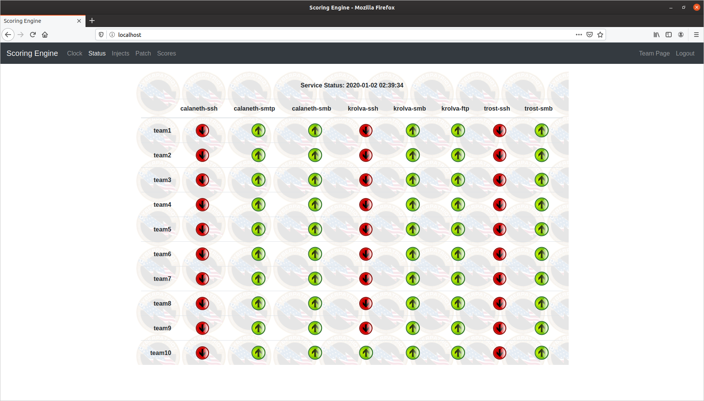
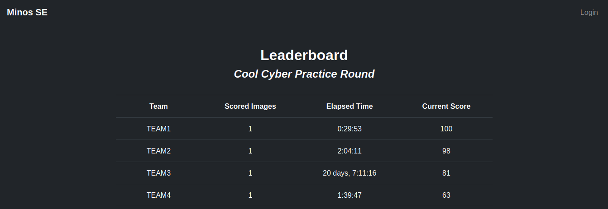
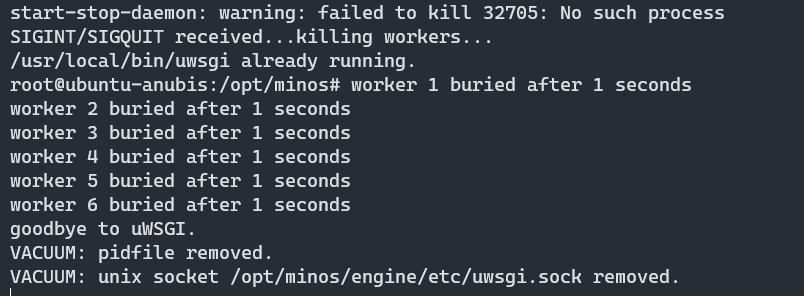
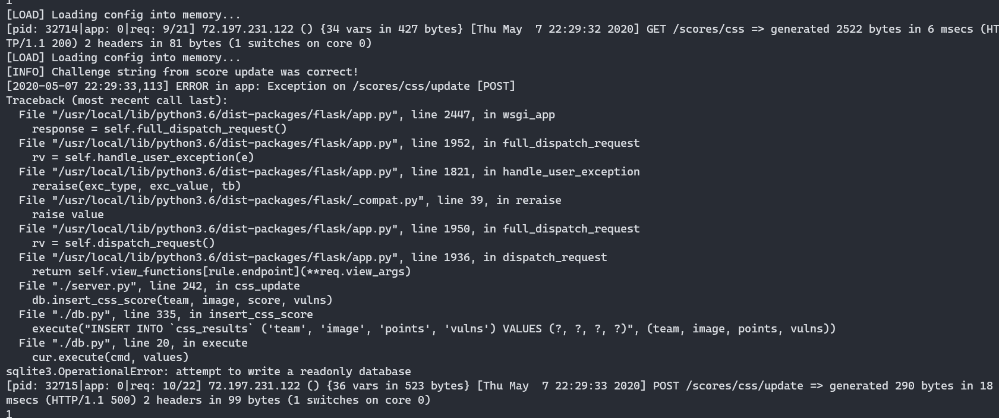

# Minos Scoring Engine

This is a scoring engine meant to imitate the functionality of UTSA's CIAS CyberPatriot Scoring Engine with an emphasis on simplicity.  It acts as an uptime scorer (ex. your service has been up 50% of the time, and is down right now). It is based on DSU's DefSec Club [Scoring Engine](https://github.com/DSUDefSec/ScoringEngine). Named after the Greek myth of King Minos, judge of the dead.

## Installation

0. Clone the repository to your local computer and `cd` to the setup dir.
```
git clone https://github.com/sourque/minos && cd minos
```
1. Spin up an Ubuntu docker container.
```
DOCKER_ID=$(sudo docker run -v $(pwd):/opt/minos -p 80:80 -td ubuntu)
```
2. Interact with the machine and run the install script
```
sudo docker exec -it $DOCKER_ID "/bin/bash"
cd /opt/minos/setup && ./install.sh
```
> If you don't want to use Docker, you can just move the repo to /opt/minos in an Ubuntu VM and run the install script. YMMV, has been tested on Ubuntu 18.10+.

3. Put your config in `/opt/minos/config.cfg`.
> Don't have a config? Copy over the example config with `cp /opt/minos/{example-,}config.cfg`.

Start the engine with `service minos start`, or `service minos start logs` if you want to see the service logs. Web interface should be up at `http://localhost`.
> You can stop the engine with `service minos stop`.

By default, the configuration and database don't reset when you start the engine, as long as there is a currently existing `running-config.cfg`. Set the `"reset=1"` option in the `[settings]` directive to reset every time the engine launches.

## Screenshots





## Features

- Uptime scoring engine
    - HTTP/HTTPS
    - SSH
    - SMB
    - FTP
    - SMTP
    - DNS
- Built-in patch server (folder of indexed files)
- Scoring check history, uptime percentages
- SLA Violation log and totals
- Clock and competition time tracker
- Timing-based injects and scoring
- CyberPatriot-esque scoring graphics and pages :)
- CSS Find-and-fix vulnerability leaderboard

## Scoring Engine Mechanics

- Check round runs every 2-3 minutes
- Team gets 1 point for each service up and functional each check
- Team gets 0 points for each service down
- Each five consecutive service down checks is -5 point penalty (SLA violation)

## Configuration

The configuration is in TOML (Tom's Obvious, Minimal Language).

The configuration is loaded from `config.cfg` the first time the scoring engine starts up, or every time if the `reset=1` option is set. You can manually re-read the config by logging in as an administrator, going to settings, and hitting `Reset`.

Here's a quick example:

```
[settings]
interval = 150 # Wait time between rounds is 150 +- 30 seconds
jitter = 30
revert_penalty = 350
network = "172.16.{}.{}" # Brackets are replaced by subnet, host

[web_admins]
white_team = "password"

[teams]
    [teams.team1]
    username = "team1"
    password = "FalseThreat"
    subnet = 10

[systems]
    [systems.coolsystem]
    host = 2
    checks = [ "ssh", "http" ]

        [systems.coolsystem.ssh]
        port = 2222

[injects.1]
time = "0:00"
type = "service"
enact_time = "0:30" # Time when service begins scoring
title = "Add HTTPS to website"
details = "Get HTTPS working on E-Commerce."

    [injects.1.services.coolsystem]
    checks = [ "https",]

         [injects.1.services.coolsystem.https]
         checkfile = "cool_https.html"

[injects.2]
time = "0:05"
type = "manual"
title = "Intrusion report"
details = "Deliver an intrusion report ASAP."
```

### Service Configuration

 The configuration for services is the same whether the service is scored at startup or later, through an inject. Inject services can be new or modify existing services (if the `modify="True"` flag is set under the services settings). Here are the checks and their properties:

#### ssh
```
[systems.systemname.ssh]
port = 2000 # Default 22
private_key = "id_rsa" # Score authentication with keys
user = "root" # User must be set for key auth
```

#### smb
```
[systems.systemname.smb]
port = 1234 # Default 445
file = "cool_bug_facts.txt" # File to retrieve
hash = "9bb6c1dc2408ee6cb09778ca2ac6abad91de9be4 " # sha1 hash of the file
domain = "bugfacts.lan" # Default None
```
> Without file or hash, authentication won't be tested.

#### http/https
```
[systems.systemname.http]
port = 1234 # Default 80
host = localhost # Parameter to pass to "Host" header (Default IP)
path = "/index.php" # Remote path to retrieve (default '/'')
file = "systemname.html" # Local checkfile to compare with
tolerance = 50 # Difference tolerance, default 20%
```
```
[systems.systemname.https]
port = 1234 # Default 443
host = localhost # Parameter to pass to "Host" header (Default IP)
path = "/index.php" # Remote path to retrieve (default '/'')
file = "systemname.html" # Local checkfile to compare with
tolerance = 50 # Difference tolerance, default 20%
```

#### ftp
```
[systems.systemname.ftp]
port = 1234 # Default 21
file = "cool_bug_facts.txt" # File to retrieve
hash = "9bb6c1dc2408ee6cb09778ca2ac6abad91de9be4 " # sha1 hash of the file
file = "systemname.html" # Local checkfile to compare with
```
> Without file or hash, authentication won't be tested.

#### smtp
```
[system.systemname.smtp]
port = 1234 # Default 25
testhost = "localhost.lan" # Server to declare yourself as. Default example.org
```

#### pop
Not supported yet.

#### imap
Not supported yet.

#### dns
```
[system.systemname.dns]
port = 1234 # Default 53
query = "cool-site.lan" # Domain to query
query_type = "AAAA" # Default 'A' (IPv4)
answer = "127.0.0.1" # Correct answer to query
```
> Without query or answer, the checker won't work.

#### rdp
Not supported yet.

### CSS Configuration

Any Client Scoring System reporting should work out of the box, albeit be less 'secure'.

```
[remote]

# If specified, incoming score reports
# will be decrypted with this key
password = "HackersArentReal"

# If specified, only these team IDs
# will be allowed to connect and issue
# score updates
teams = [ "TEAM-12398fhn",
          "TEAM-qwertyui" ]

# If specified, replace the above team IDs
# with the below aliases (one to one)
# Note: aliases without team IDs above
# will cause an error. A greater number
# of aliases than teams will cause an error.
# You can have more team IDs than aliases,
# however.
team_aliases = [ "team1",
                 "team2" ]

# If specified, only allow score updates
# for the following image names
images = [ "supercoolimage1",
           "supercoolimage2" ]

# If specified, client will stop giving
# feedback after this elapsed time
time_limit = "6:00"
```

## Patch Server

Put any files you want served with the patch server in `/opt/minos/patch`.

## Injects

Injects are all based on the competition time. There are three types of injects:
- Service: will add a new scored service to all teams
```
[injects.1]
time = "0:05"
type = "service"
enact_time = "0:35"
title = "Add FTP server"
files = [ "file.pdf", ]
details = "Hello, please add the attached file to a new FTP server on Server3."

    [injects.1.services.server3]
    checks = [ "ftp",]

        [injects.1.services.server3.ftp]
        file = "file.pdf"
        hash = "05ec7de5d536998263a73b5da698711f7bfffb58"
```
> Put all your inject files in `/opt/minos/injectfiles`.
- Manual: manually scored injects (ex. intrusion reports, memos, changelogs)
```
[injects.1]
time = "0:05"
type = "manual"
title = "Add Server2 to the Domain"
details = "Hello, please attach Server2 to the domain LocalDomain.lan."
points = 500
```
- Custom: (WIP) test for a condition in the client scoring engine

## Troubleshooting

**Service won't restart**


- On some operating systems (notably DigitalOcean boxes), the init.d script fails to manage the service correctly.
- You can manually kill the python and uwsgi processes.
 - `sudo pkill -9 python3; pkill -p uwsgi`

**Read-Only Database**


- This occurs because the database is owned by root (the `Minos` process) and can't be read by the `uwsgi` worker threads.
- The solution is to `chown` everything.
 - `chown -R www-data:www-data /opt/minos`

## Contributing and Disclaimer

If you have anything you would like to add or fix, please make a pull request! No improvement or fix is too small, and help is always appreciated.

This project is in no way affiliated with or endorsed by the Air Force Association, University of Texas San Antonio, or the CyberPatriot program.
